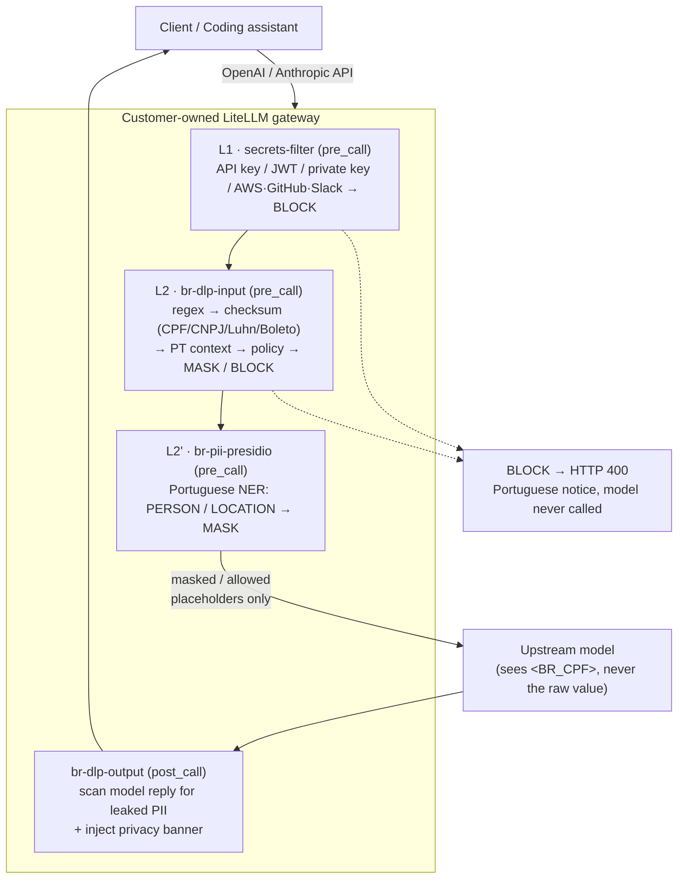

# br-fintech-llm-dlp

**Gateway-side DLP for LLM prompts — purpose-built for Brazilian fintech.**

When a user accidentally pastes a **CPF, credit card, PIX key, Boleto, or
password** into an LLM prompt, this LiteLLM guardrail **masks or blocks it before
the request ever leaves your gateway**, and tells the user (in Portuguese) what
happened. The raw sensitive value **never reaches any cloud/model vendor**.

> 🇧🇷 Brazil-localized detection with checksum validation (CPF/CNPJ/Luhn/Boleto)
> + Portuguese context weighting + Presidio Portuguese NER.
> 🔒 `pre_call` enforcement, fail-closed, **no raw-content logging** (LGPD-aligned).
>
> 📄 Chinese technical doc: [`README.zh-CN.md`](./README.zh-CN.md) ·
> Proposal: [EN](./PROPOSAL_EN.md) / [中文](./PROPOSAL.md) ·
> Demo script: [EN](./DEMO_SCRIPT_EN.md) / [中文](./DEMO_SCRIPT.md)

---

## Why at the gateway (not the vendor's built-in measures)

Relying on a cloud/model vendor's content-moderation or DLP has a fundamental
contradiction: **to be inspected by the vendor, the raw text must first be sent
to the vendor** — i.e. to "prevent exfiltration," you exfiltrate first. The only
place that genuinely protects privacy is **before data leaves your boundary** —
your own gateway. After masking here, the upstream model only ever sees a
placeholder like `<BR_CPF>`. See [`PROPOSAL_EN.md`](./PROPOSAL_EN.md) §3.

---

## Architecture



Hard constraints: **pre_call only** (raw never races ahead to the model),
**fail-closed** (scanner error ⇒ reject), **no raw logging** (audit records carry
entity types only, `raw_content_logged=false`).

---

## Detection coverage

| Entity | Method | Action | Threshold |
|---|---|---|---|
| BR_CPF | regex + **mod-11 checksum** + context | MASK | 0.85 |
| BR_CNPJ | regex + checksum (incl. 2026 alphanumeric format) | MASK | 0.80 |
| BR_PIX_KEY | UUID v4 + required pix/chave context | MASK | 0.65 |
| BR_PHONE | +55 direct; national format needs context | MASK | 0.65 |
| BR_CEP | regex + required endereço/cep context | MASK | 0.65 |
| EMAIL | regex | MASK | 0.80 |
| BR_BOLETO | 47-digit linha digitável + **3× mod-10** | BLOCK | 0.90 |
| CREDIT_CARD | regex + **Luhn** | BLOCK | 0.80 |
| AUTH_SECRET | senha/PIN/OTP/CVV keyword + value-shape score | BLOCK | 0.70 |
| PERSON / LOCATION | Presidio Portuguese NER (`pt_core_news_md`) | MASK | 0.80 |

False-positive protection (tested): a CPF with a wrong check digit does not
match; "esqueci minha senha" (help-seeking, no password value) is not blocked; a
bare UUID with no pix context (e.g. a request id) does not match.

Edit `config/br_dlp_policy.yaml` and restart the gateway to change thresholds,
actions, or the Portuguese messages — no code change.

---

## Key behaviors

- **Three actions** — allow / **MASK** (placeholder, model still called) /
  **BLOCK** (credentials; model never called).
- **Explicit masking banner** — MASK is not silent; the user sees a Portuguese
  privacy notice before the answer, listing the hidden data types. Implemented
  for both non-streaming (`async_post_call_success_hook`) and streaming
  (`async_post_call_streaming_iterator_hook`, banner as the first chunk).
- **History-pollution guidance** — because clients resend full history, a prior
  message with sensitive data keeps blocking every turn. The guardrail
  distinguishes "sensitive data in the current input" vs "only in history" and
  guides the user to `/clear` in the latter case.
- **Opt-in activation** — all guardrails are `default_on: false`; they trigger
  only when the request carries `guardrails: [...]`. A dedicated `claude-elo`
  shim injects this, leaving other entry points untouched.

---

## Optional: reuse your own enterprise DLP (PEP/PDP)

`guardrails/enterprise_dlp_guardrail.py` is an adapter that makes your **existing**
DLP the policy brain (PDP) while the gateway stays the enforcement point (PEP).
Three modes — `shadow` (observe), `sidecar` (async audit), `inline` (enforce) —
with `on_error: block|passthrough`. Only `_call_dlp()` needs your vendor's API
contract. Enforcement and masking still happen at the gateway; raw text never
leaves your boundary to a cloud/model vendor.

---

## Repository layout

```
├── guardrails/
│   ├── br_dlp_guardrail.py          # core CustomGuardrail (detect + policy + audit)
│   └── enterprise_dlp_guardrail.py  # adapter to reuse an in-house DLP (PEP/PDP)
├── config/br_dlp_policy.yaml        # entity → action/threshold policy (runtime-editable)
├── shim/                            # claude-elo opt-in trigger chain
│   ├── server.js                    #   guardrail-injection shim (:4020)
│   ├── start.sh / stop.sh           #   shim lifecycle
│   └── start-adapter.sh             #   dedicated Anthropic adapter (:4021)
├── presidio/                        # Portuguese NER layer (analyzer/anonymizer)
│   ├── docker-compose.presidio.yml
│   ├── Dockerfile.analyzer-pt       #   presidio-analyzer + pt_core_news_md
│   └── *_conf_pt.yaml / recognizers_pt.yaml
├── tests/
│   ├── test_detectors.py            # detection-logic unit tests
│   └── test_e2e.py                  # end-to-end tests against the proxy
├── PROPOSAL.md / PROPOSAL_EN.md     # customer proposal (中文 / English)
└── DEMO_SCRIPT.md / DEMO_SCRIPT_EN.md
```

---

## Quick start

This repo holds the guardrail + policy + Presidio config that mount into a
LiteLLM proxy. Register the guardrails in your `litellm_config.yaml`
(`pre_call` for input, `post_call` for output; register the output guardrail
**last** so the privacy banner is not re-masked by Presidio), mount the files
into the container, then:

```bash
# bring up the proxy + Presidio Portuguese services
docker compose -f docker-compose.yml \
  -f presidio/docker-compose.presidio.yml up -d

# end-to-end tests (allow / MASK / BLOCK / PT messages / FP protection / NER)
python3 tests/test_e2e.py

# inspect one guardrail's masking without calling a real model
curl -s http://localhost:4000/guardrails/apply_guardrail \
  -H "Authorization: Bearer $LITELLM_MASTER_KEY" -H "Content-Type: application/json" \
  -d '{"guardrail_name":"br-pii-presidio","text":"meu nome é João da Silva","language":"pt"}'
# → {"response_text": "meu nome é <PERSON>"}
```

See [`README.zh-CN.md`](./README.zh-CN.md) for full deployment notes, design
decisions, and the known-boundaries / roadmap section.

---

## License

[MIT](./LICENSE)
